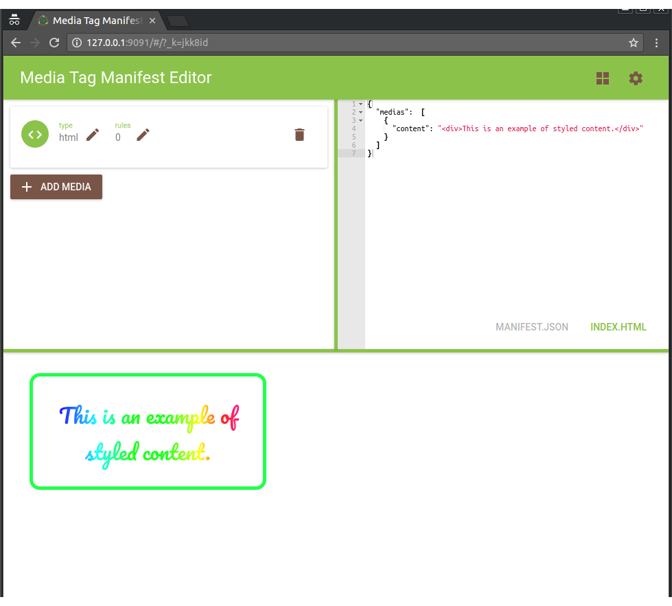

**Media Tag Manifest Editor** is a web application, made with React, that
allows a user to create and edit Media Tag manifests.

## Usage

:bangbang: Make sure your node is at least version 6.

```
npm i          # Install dependencies
npm run build  # Build media-tag and application, creates ./dist with all needed files
npm start      # Start 3 servers: frontend application, assets and media server
```

## Assets

The assets related to DASH content are not included in the project due
to its size (more than 2GB). In order to have functional DASH
templates, you can easily download them by following the instructions
in the Media Tag project readme.

## Templates

Templates are available in the folder `src/app/templates/`.
The file `src/app/templates/index.js` contains the list that will be
shown inside the editor (with the respective labels).

To add a new template you can create new files inside template
directory and add their references inside the `index.js` file.
Be aware that, with the current configuration, only files
named `*.tpl.html` and `*.tpl.json` are read as strings by the
bundler.

## References

* Backend
	* https://www.filestack.com/
	* https://github.com/vishesh04/Filesutra
	* https://github.com/silexlabs/unifile
	* https://github.com/silexlabs/cloud-explorer/
* Editors
	* https://jsfiddle.net/
	* https://jsbin.com/?html,css,js,console,output
	* http://codepen.io/pen/
